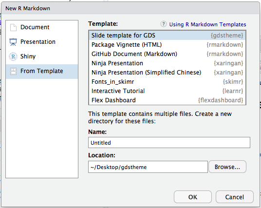

# {gdstheme}

<!-- badges: start -->
[](https://www.tidyverse.org/lifecycle/#experimental)
[](https://www.rostrum.blog/2019/05/24/xaringan-template/)
<!-- badges: end -->


## tl;dr

R package containing [{xaringan}](https://github.com/yihui/xaringan) presentation theme and template in the style of the UK's [Government Digital Services](https://gds.blog.gov.uk/). See:

* [a live template example](https://matt-dray.github.io/gdstheme/)
* [a blog post about its development](https://www.rostrum.blog/2019/05/24/xaringan-template/)

## Purpose

This package provides an unofficial, unbranded theme and slide template that mimics the style of slides at [Government Digital Service](https://www.gov.uk/government/organisations/government-digital-service) (GDS), part of the UK's [Cabinet Office](https://www.gov.uk/government/organisations/cabinet-office).

You can use it to integrate easily the outputs of R code with your slides to help make them more reproducible. Otherwise, you have to generate outputs separately and source them in.

I, and this project, are no longer affiliated with GDS.

## Install

The template requires the [{xaringan}](https://github.com/yihui/xaringan) package by [Yihui Xie](https://yihui.name/), which provides an implementation of [remark.js](https://github.com/gnab/remark) through R Markdown. It will be installed when you download {gdstheme}

```{r}
# install.packages("remotes")
remotes::install_github("matt-dray/gdstheme")
```

## Begin a slideshow

To open the {gdstheme} template in RStudio, go to `File` > `New File` > `RMarkdown...` > `From Template` > `Slide template for GDS`



You can also use the `draft()` function from the {rmarkdown} package:

```{r}
rmarkdown::draft(
  file = "doc_name.Rmd",
  template = "gdstheme",
  package = "gdstheme"
)
```

## Styling

### Classes

These classes should be specified at the top of each slide.

| Code | Class description | Example |
| :- | :- | :- |
| `class: title-slide, bottom` | Title slide class (text at bottom) | [Title slide](https://matt-dray.github.io/gdstheme/#1) |
| `class: inverse, middle` | Text heading slide class (text in the middle) | [Heading slide](https://matt-dray.github.io/gdstheme/#2) |
| `class: inverse, middle`<br>`background-image: url("path/to/image.jpg")`<br>`background-size: cover` | Text heading slide class (text in the middle) with background image | Image heading slide [with text](https://matt-dray.github.io/gdstheme/#3) and [without](https://matt-dray.github.io/gdstheme/#6) |
| [blank] | The regular text slide class is the default and doesn't need to be declared | [A text slide](https://matt-dray.github.io/gdstheme/#4) |

So this would be rendered into a heading slide:

```
---
class: heading-slide, middle

This is a heading slide

```

### Helpers

These are useful snippets that can help transform elements on the page.

| Code | Purpose | Example |
| :- | :- | :- |
| `.bold[Text]` | Makes text bold | ['Firstname Lastname' on title slide](https://matt-dray.github.io/gdstheme/#1) |
| `.black[Text]` | Makes text black (use for contrast on heading slides) | [Text on heading slide](https://matt-dray.github.io/gdstheme/#3) |
| `.pull-left[Content]` | Content in left half of slide only | [Text on this slide](https://matt-dray.github.io/gdstheme/#7) |
| `.pull-right[Content]` | Content in right half of slide only | [Image on this slide](https://matt-dray.github.io/gdstheme/#7) |

So you could have a slide with an annotated image like this:

```
---

.pull-left[This is how to annotate an image]
.pull-right[]

```

## Contribute

Please feel free [leave an issue](https://github.com/matt-dray/gdstheme/issues). Please follow [the code of conduct](https://github.com/matt-dray/gdstheme/blob/master/CODE_OF_CONDUCT.md).
